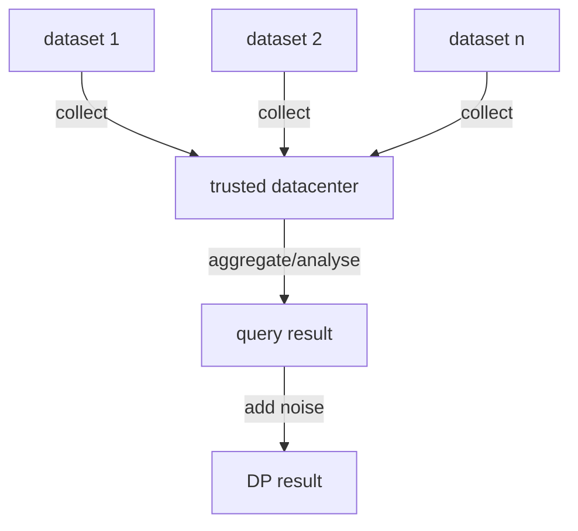
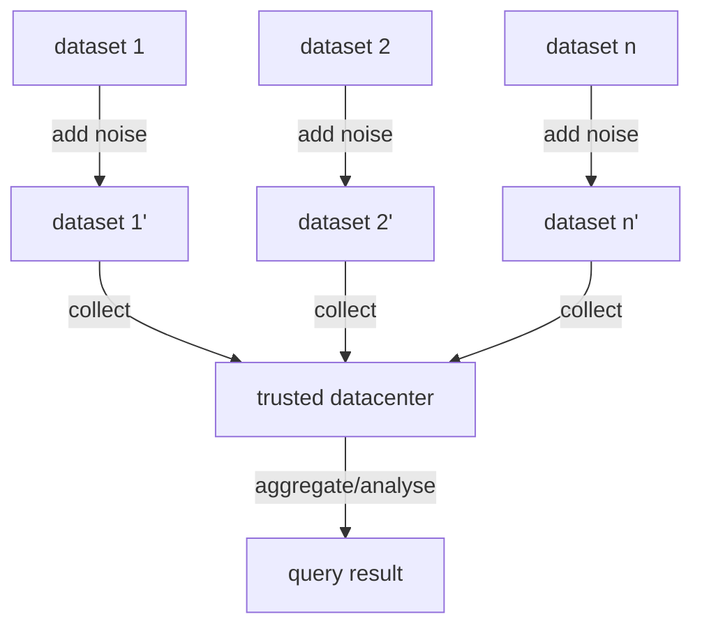

## 全局vs本地差分隐私

数据统计分析里面，本地差分隐私默认相对于全局差分隐私而言的。 从定义上来说都一样，但是针对的场景不同。传统的差分隐私是将各方的原始数据集中到一个**可信的数据中心**， 然后对计算结果做添加噪音，实施差分隐私， 也被称中心化差分隐私。但是这种**可信的数据中心**很难实现。所以就出现了本地差分隐私。



<center>图1： 全局差分隐私</center>

本地差分隐私为了消除可信数据中心，直接在用户的数据集上做差分隐私，然后再传输到数据中心进行聚合计算，这样数据中心也无法猜测出原始数据，从而保护数据隐私。



那么对于局i部差分隐私的定义，依然跟全局差分隐私一致：

**差分隐私** 假设 $ \epsilon $ 是一个正实数，$\mathcal{A}$ 是一个随机(差分)算法，输入是数据集，$im\mathcal{A}$是$\mathcal{A}$的原像，对于任意2个元素个数相差1的数据集$D_1, D_2$，算法$\mathcal{A}$满足如下条件，则称其为 $\epsilon$-差分隐私算法： 
$$
Pr[{\mathcal{A}(D_1) \in S}] \le e^{\epsilon}\cdot Pr[\mathcal{A}(D_2) \in S]
$$
其中S是$im{\mathcal{A}}$的任意子集, 可见： 

1. 本地化差分隐私技术通过控制任意两条记录的输出结果的相似性，从而确保算法$\mathcal{A}$满足本地化差分隐私，即输出同为$\mathcal{A}(D_1)$，窃密者无法确认输入为还是$D_1$还是$D_2$,  
2. $\epsilon$越小，$e^{\epsilon}$接近于1，输出结果相似性越高，保护程度也就越好；反之，亦然。

**隐私敏感度**  定义敏感度如下：
$$
{ \Delta f=\max \lVert f(D_{1})-f(D_{2})\rVert _{1}}
$$
其中$\lVert*\rVert_1$表示$l_1$范式。 f就可以看做任意的查询函数。


本地差分隐私在消除原始数据集中的劣势的同时也引入了一个很难处理的问题：局部敏感度计算的时候不需要涉及到加法和乘法等运算，因此其敏感度是比较精准的，但是针对大量的数据集直接计算局部敏感度是不现实的，其次添加局部敏感度之后的中间结果，在进行加法或者乘法等，会导致敏感度扩大，从而导致数据可用性降低。。例如SQL的join query，就是典型的跨数据集的查询，等值join（特别是同一个表之间的join）之后进行聚合(count/sum/max/avg等)，包括嵌套的聚合，会导致最终噪音的大小很难控制。

拿Uber的SQL DP论文(参考1)来举例，可以很好的解释这个差别，SQL DP同时引入一个新的敏感度方法：弹性敏感度(Elastic Sensitivity)来解决局部差分隐私可能导致噪音无界的问题。

首先论文定义了全局敏感度（见上面的隐私敏感度定义）以及局部敏感度：

**局部隐私敏感度 ** 对于局部的数据集x（为了方便表示变量，不再采用$D_i$表示），任意数据集合y， x、y的记录数相差1，即$d(x, y) = 1$,  定义局部敏感度如下：
$$
LS_f(x) = max \lVert f(x) - f(y)\rVert_1
$$
局部敏感度往往会比全局敏感度要小，因为全局敏感度定义里面x也是任意的。 

如果d(x, y) = k, 定义局部敏感度如下：
$$
A_f^{(k)}(x) = \mathop{max} \limits_{y\in D^n; d(x, y) \le k} LS_f(y)
$$
弹性敏感度则是基于局部敏感度的基础上，计算局部敏感度的上界，借助于敏感度传递手段，最终提升结果的可用度。

下面通过一个实际的例子讲解下DP SQL的思路。 首先假设我们的query root是count函数，并且sql用到了等值join($\bowtie$)。查询sql如下：

```
SELECT count (a1) FROM A JOIN B ON A.a2 = B.a3
```

针对不同数据集(表格)， 提前计算好每个表格的每列的（对于非数值列要特殊处理）：

* 最大/最小值 mx/mn （这2个在当前sql没有被用到，但是在max/min中会被用到）
* 最大频度值 mf

其中一个很重要的引理：
$$
mf_k (a, r, x) \ge \mathop{max}\limits_{y : d(x, y) \le k}\ mf(a, r, y)
$$
针对查询sql对应的关系代数r，数据集条数相差为k（也被成为距离），在针对查询中关联涉及到的表x在列a上面进行等值join， 列a的最大频次可以按照如下计算：

对于单个表格t， 非常好理解:
$$
\mathop{max}\limits_{y : d(x, y) \le k}\ mf(a, r, y) = mf(a, r, x) + k;
$$
对于等值聚合查询 $r_1 \mathop{\bowtie} \limits_{a_2 = a_3} r_2$ （证明参考论文1）:
$$
\mathop{max}\limits_{y : d(x, y) \le k}\ mf(a_1, r_1 \mathop{\bowtie} \limits_{a_2 = a_3} r_2, y) \ge 

\mathop{max} \limits_{y: d(x, y) \le k} mf(a_1, r_1, y) mf(a_3, r_2, y)
$$
因此，可以按照这个规则进行递归去计算聚合查询的列的频度信息。

从而得到弹性隐私度$\hat{S}^{(k)}(q, x)$的计算公式（推导过程见论文1）如下：
$$
A_q^{(k)} (x) \le \hat{S}^{(k)}(q, x)
$$
针对其他的聚合函数，例如sum、avg等，可以基于已有的属性mx/mn/mf的基础上进行上界分析。

​	可以看到，在这种跨域联合查询中，在本地差分的基础上，结合一系列具体的全局差分隐私控制手段，可以在可用性和隐私保护上面，获得一个更好的”双赢“结局。

#### 参考 

1.  Towards Practical Differential Privacy for SQL Queries  https://arxiv.org/pdf/1706.09479.pdf
2. Additive Noise Mechanism https://en.wikipedia.org/wiki/Additive_noise_mechanisms